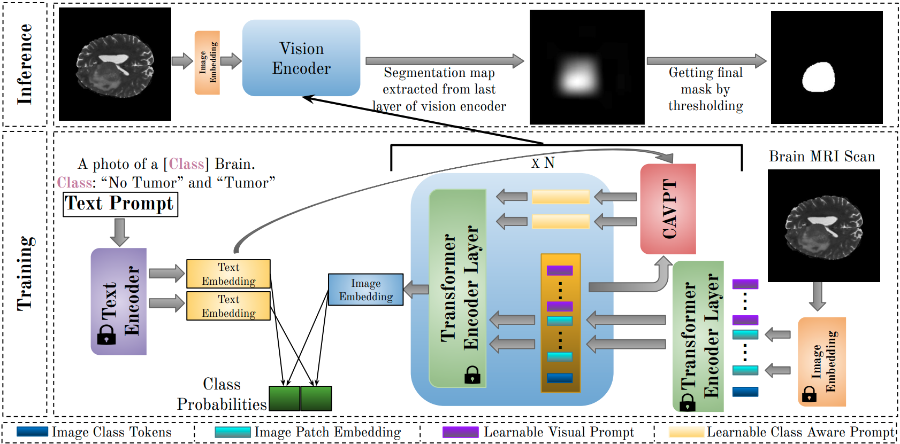

# DDPT (Discriminative Dual Prompt Tuning)

## Overview
DDPT is a vision-language model adaptation framework (based on CLIP with CoOp and VPT extensions) for tasks like medical image analysis (e.g., brain tumor detection in BraTS datasets). This README covers setup, usage, and recent updates to make the system more flexible via command-line interfaces.


<div align="center">
  
  <p><em>DDPT Framework Architecture</em></p>
</div>

## Recent Changes (From AI-Assisted Session)
The following updates were made to improve usability:
- **run.sh Modifications**:
  - Added CLI argument parsing for --Training, --Dataset, --Evaluation, and --Checkpoint.
  - Validates dataset structure and inputs.
  - Supports training on 80% of Training_images/ and evaluation on 100% of Training_images/.
  - Ignores Testing_images/ entirely.
  - Conditional execution: Train only, eval only (with checkpoint), or both.
- **trainers/DPT.py Modifications**:
  - Updated map saving in create_maps_eval to use Training_images/Maps/ as the output directory.
  - Ensured directory creation and preserved core logic.

These changes allow full control without editing scripts.

## Dataset Structure
Datasets must follow this structure under ../DATA/<dataset_name>/:
```
<dataset_name>/
├── Training_images/
│   ├── Healthy/
│   └── Unhealthy/
└── Testing_images/  (Ignored by the script)
    ├── Healthy/
    └── Unhealthy/
```
- Training/evaluation only uses Training_images/.
- Maps are saved to Training_images/Maps/.

## Usage
Run the script with:
```bash
bash run.sh [--Training True/False] [--Dataset BraTS20/BraTS21/BraTS23/MSD] [--Evaluation True/False] [--Checkpoint /path/to/model.pth]
```

### Scenarios
1. **Train (80%) + Infer (100%)**:
   ```bash
   bash run.sh --Training True --Dataset BraTS20 --Evaluation True
   ```

2. **Train only (80%)**:
   ```bash
   bash run.sh --Training True --Dataset BraTS20 --Evaluation False
   ```

3. **Infer only (100%) with pretrained**:
   ```bash
   bash run.sh --Training False --Dataset BraTS20 --Evaluation True --Checkpoint /path/to/model.pth
   ```

- Training: Uses 80% split of Training_images/ (via config overrides).
- Evaluation: Generates maps for 100% of Training_images/, saved to Training_images/Maps/.
- Checkpoint: Required for eval-only; optional for resuming training.

## Additional Notes
- Dependencies: Ensure CLIP, torch, etc., are installed (see requirements.txt).
- Configuration: Advanced params (e.g., epochs, thresholds) are hardcoded in run.sh but can be edited if needed.
- Output: Models saved to MODEL_DIR; logs in output/.

For issues, check validation errors or consult the original codebase.
